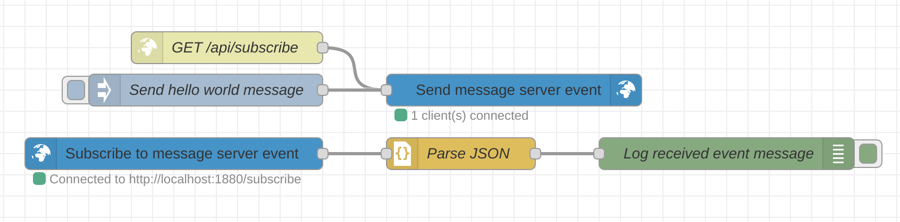

# Node Red Server Sent Event Nodes


The Node-RED SSE Package is a collection of two nodes that provide functionality for working with Server-Sent Events (SSE) in Node-RED. Server-Sent Events is a technology that allows the server to push updates to the client in real-time over a single HTTP connection. This package simplifies the process of implementing SSE functionality in your Node-RED flows.

## Nodes



### SSE Server Node

The SSE Server node allows you to create a server that clients can subscribe to. All connected clients will then receive realtime notificaitons from another input node. This node must originate from a default http in node.

#### Example: Configure the node

To set up the SSE Server node, follow these steps:

- Drag and drop the http in node from the Node-RED palette onto your flow.
- Configure the http in node with the desired endpoint the HTTP GET method
- Connect the http in node to the SSE Server node.
- Connect an inject node into the SSE Server node.
- Configure the SSE Server node by specifying the event name and data to be sent to the subscribed clients.
- Deploy your flow to activate the SSE Server.
- Once the SSE Server is up and running, clients can subscribe to it using the SSE Client node described below.
- Alternatively, you can use the `EventSource` browser API. Check out the [official MDN docs](https://developer.mozilla.org/en-US/docs/Web/API/Server-sent_events) to learn more.

Alternatively to setting the event name and its data in the node, you can specify them using the `msg.topic` and `msg.payload` property.

#### Example: Setting the event's data and type

```js
// When setting the message's topic and payload...
msg.topic = 'message'
msg.payload = {
  hello: 'world'
}

// ... the resulting event sent to a client looks like this:
event: message
data: "{'hello': 'world'}"

// A frontend client using Javascript's EventSource api can then access this message like so:
const sse = new EventSource('http://localhost:1880/api/sse');
sse.addEventListener('message', (event) => {
  console.log(event);
})
```

#### Example: Using a custom topic / event type

As you saw in the example above, each event can have a specific type. The default type for SSE is 'message'. If you would like to change the name of the event type, you can set the `msg.topic` to a custom name. This can be useful when using several distinct events you would like to send to one or several connected clients.

> Note that EventSource has reserved keywords, such as 'error' and 'open' which should not be used as a SSE event name.

```js
// When setting the message's topic and payload...
msg.topic = 'reload'
msg.payload = {
  reload: true,
  date: new Date()
}

// ... the resulting event sent to a client looks like this:
event: reload
data: "{'reload': true, 'date': '...'}"

// A frontend client using Javascript's EventSource api can then access this message like so:
const sse = new EventSource('http://localhost:1880/api/sse');
sse.addEventListener('reload', (event) => {
  console.log(event);
})
```


### SSE Client Node

The SSE Client node allows you to subscribe to SSE servers and receive real-time updates from them.

To set up the SSE Client node, follow these steps:

- Drag and drop the SSE Client node from the Node-RED palette onto your flow.
- Configure the SSE Client node by specifying the URL of the SSE server to subscribe to.
- Connect the SSE Client node to the desired downstream nodes in your flow.
- Deploy your flow to activate the SSE Client.
- Once the SSE Client is subscribed to a server, it will receive events in real-time.

#### Example: Configure the node

Here's an example scenario to illustrate the usage of the SSE Server and SSE Client nodes together:

- Set up an SSE Server node with an HTTP endpoint `/subscribe` and an event name `message`.
- Connect the SSE Server node to a function node that generates a random temperature value.
- Set up an SSE Client node and configure it to subscribe to `http://localhost:1880/subscribe` and put an event name of `message`.
- Connect the SSE Client node to a debug node to display the received event data.
- Deploy the flow and open the Node-RED editor.
- The SSE Client node will receive the event SSE node in real-time and display it in the debug node.

[You can also find an example flow in the package repository](https://github.com/tq-bit/node-red-contrib-server-sent-events/blob/master/examples/example1.jsons)

#### Example: Configure HTTP request headers

When a subscription is established, HTTP headers may be sent to the receiving endpoint. You can configure these in JSON format.
In the client node, you can add headers using a key-value pair like so:

```json
{
  "authorization": "Basic abcdef==",
  "accept": "application/json"
}
```

## Example HTML client

Copy-paste this markup into an HTML page:

```html
<!DOCTYPE html>
<html lang="en">

<head>
  <meta charset="UTF-8">
  <meta name="viewport" content="width=device-width, initial-scale=1.0">
  <title>Node Red SSE Test</title>
</head>

<body>
  <h1>Node Red SSE Test</h1>
  <p>This is a test page which will subscribe to an SSE Server powered by <a href="https://www.npmjs.com/package/@tq-bit/node-red-contrib-server-sent-events"
      target="_blank"><code>node-red-contrib-server-sent-events</code></a></p>
  <p>Enter your input to this field and click submit</p>

  <input id="input" type="text" placeholder="http://localhost:1880/subscribe" />
  <button id="submit">Submit</button>

  <h2>Status</h2>
  <div id="status">Not connected</div>

  <h2>Messages</h2>
  <div id="messages">
    <p>Messages sent from an SSE server will be displayed here</p>
  </div>

  <!-- Script to handle the EventSource API -->
  <script>
    const input = document.getElementById("input");
    const submit = document.getElementById("submit");
    const status = document.getElementById("status");
    const messages = document.getElementById("messages");

    submit.addEventListener("click", () => {
      const url = input.value;
      const eventSource = new EventSource(url);

      eventSource.addEventListener('open', () => {
        status.innerHTML = `Connected to ${url}`;
      })
      eventSource.addEventListener('error', () => {
        status.innerHTML = `Disconnected from ${url}`
      })
      eventSource.addEventListener("message", (event) => {
        messages.innerHTML += `<p>${event.data}</p>`;
      });
    });
  </script>
</body>
</html>
```

## Support and Feedback

If you encounter any issues or have any feedback regarding the Node-RED SSE Package, please feel free to open an issue on the package's [GitHub repository](https://github.com/tq-bit/node-red-contrib-server-sent-events). I appreciate your feedback and will do my best to address any problems or feature requests.

## License

The Node-RED SSE Package is released under the Apache 2.0 license. Please refer to the `license` file in the package repository for more information.
